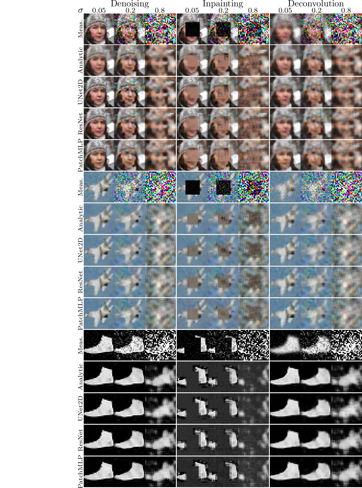

## Code for the paper: [An analytic theory of convolutional neural network inverse problems solvers](https://arxiv.org/abs/2601.10334)
 
This repository contains the code to reproduce the experiments presented in the paper. 



The code is implemented in Python using PyTorch.
The only requirement is PyTorch. You can install it via pip:

```
    pip install torch torchvision
```


### Getting started
We provide a jupyter notebook `demo.ipynb` that demonstrates how to use the provided code to reproduce the results from the paper. 
The pretrained models will be automatically downloaded when you run the notebook.

